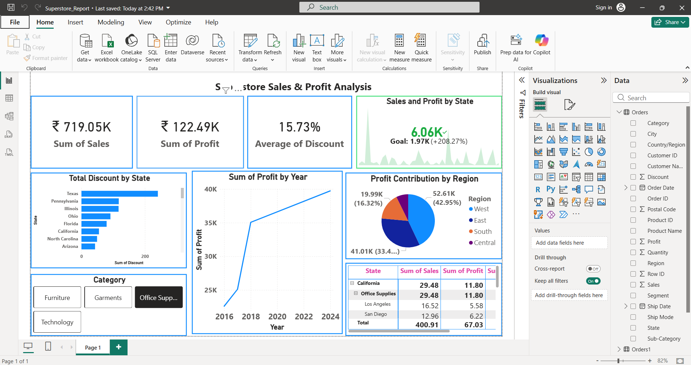

# 📊 Superstore Sales & Profit Analysis | Power BI

## 🔍 Project Overview

This project presents an interactive Superstore Sales & Profit Analysis dashboard developed using Power BI.  
The dashboard analyzes sales, profit, discount, state, and regional performance to generate meaningful business insights and support strategic decision-making.

The primary objective of this project is to demonstrate end-to-end business intelligence skills including data modeling, KPI creation, DAX calculations, and professional dashboard design.

---

## 📁 Dataset Description

The dataset contains transactional sales records with the following key attributes:

- Order ID  
- Order Date  
- Ship Date  
- Customer ID  
- State  
- Region  
- Category  
- Sub-Category  
- Sales  
- Profit  
- Discount  
- Quantity  

The dataset is included in this repository.

---

## 📈 Key Performance Indicators (KPIs)

The dashboard highlights the following core business metrics:

- 💰 Total Sales Revenue  
- 📈 Total Profit  
- 📉 Average Discount Percentage  
- 📊 Profit Trend by Year  
- 🗺 Total Discount by State  
- 🌎 Regional Profit Contribution  

DAX functions used in this project include:

- SUM  
- AVERAGE  
- CALCULATE  
- YEAR  
- DIVIDE  

---

## 📊 Dashboard Features

- Interactive filters for Category and Region  
- Year-wise profit trend analysis  
- State-level discount comparison  
- Regional contribution to overall profit  
- KPI cards with performance indicators  
- Dynamic visual updates based on user selection  

---

## 📌 Business Insights Generated

- Identified top-performing regions contributing the highest profit  
- Analyzed the relationship between discount levels and profitability  
- Observed consistent year-over-year profit growth  
- Highlighted states offering higher discounts impacting margins  

---

## 🛠 Tools & Technologies Used

- Power BI Desktop  
- DAX (Data Analysis Expressions)  
- Microsoft Excel  
- Business Intelligence & Data Visualization Principles  

---

## 🖼 Dashboard Preview

---

## 🎯 Skills Demonstrated

- Data Cleaning & Modeling  
- KPI Development  
- Time-based Analysis  
- Profitability Analysis  
- Interactive Dashboard Design  
- Business Insight Generation  

---

## 🚀 Future Enhancements

- Implement Profit Margin % analysis  
- Add Year-over-Year (YoY) growth metrics  
- Introduce advanced time intelligence functions  
- Build drill-through pages for state-level deep dive  

---

## 👨‍💻 Author

**Patri Chaitanya Sri Lalitha Sai**  
Aspiring Data Analyst | Power BI & Business Intelligence Enthusiast  

📌 Passionate about transforming raw data into actionable business insights through data visualization and analytics.

🔗 LinkedIn: https://www.linkedin.com/in/patri-chaitanya-sri-lalitha-sai-2a53bb278/  
🔗 GitHub: https://github.com/patri-chaitanya
